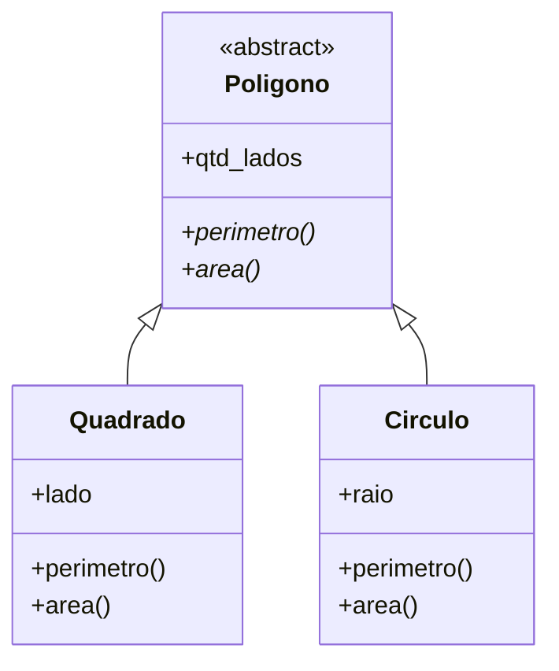

# Desafio 23

## Objetivo
Implementar o seguinte diagrama de classes:

```mermaid
classDiagram
    class Poligono {
        <<abstract>>
        +qtd_lados
        +perimetro()*
        +area()*
    }
    class Quadrado {
        +lado
        +perimetro()
        +area()
    }
    class Circulo {
        +raio
        +perimetro()
        +area()
    }
    Poligono <|-- Quadrado
    Poligono <|-- Circulo
```