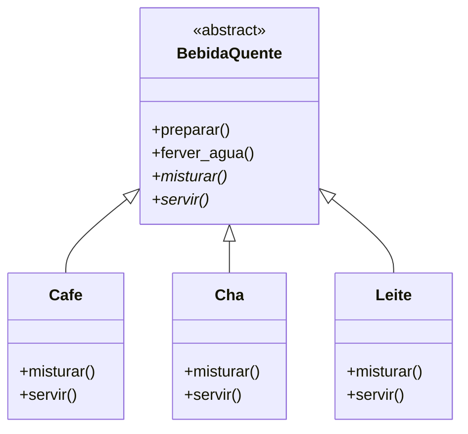

# Desafio 24

## Objetivo

Simule uma cafeteira orientada a objetos.

```mermaid
classDiagram
    class BebidaQuente {
        <<abstract>>
        +preparar()
        +ferver_agua()
        +misturar()*
        +servir()*
    }
    class Cafe {
        +misturar()
        +servir()
    }
    class Cha {
        +misturar()
        +servir()
    }
    class Leite {
        +misturar()
        +servir()
    }

    BebidaQuente <|-- Cafe
    BebidaQuente <|-- Cha
    BebidaQuente <|-- Leite
```