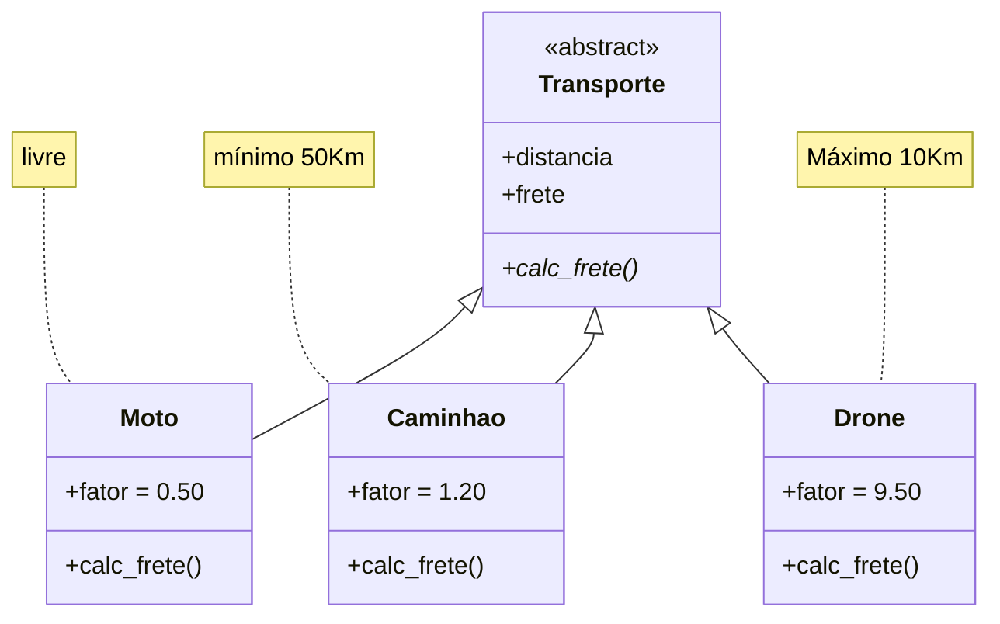

# Desafio 25

## Objetivo

Crie classes capazes de calcular fretes de veículos diferentes.

```mermaid
classDiagram
    class Transporte {
        <<abstract>>
        +distancia
        +frete
        +calc_frete()*
    }

    class Moto {
        +fator = 0.50
        +calc_frete()
    }

    class Caminhao {
        +fator = 1.20
        +calc_frete()
    }

    class Drone {
        +fator = 9.50
        +calc_frete()
    }

    Transporte <|-- Moto
    Transporte <|-- Caminhao
    Transporte <|-- Drone

    
    note for Moto "livre"
    note for Caminhao "mínimo 50Km"
    note for Drone "Máximo 10Km"
```