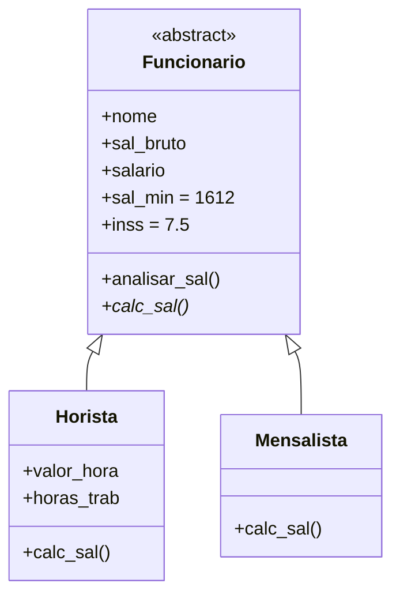

# Desafio 26

## Objetivo

Crie a estrutura capaz de calcular salários de funcionários diferentes

```mermaid
classDiagram
    class Funcionario {
        <<abstract>>
        +nome
        +sal_bruto
        +salario
        +sal_min = 1612
        +inss = 7.5
        +analisar_sal()
        +calc_sal()*
    }
    class Horista {
        +valor_hora
        +horas_trab
        +calc_sal()
    }
    class Mensalista {
        +calc_sal()
    }

    Funcionario <|-- Horista
    Funcionario <|-- Mensalista
```