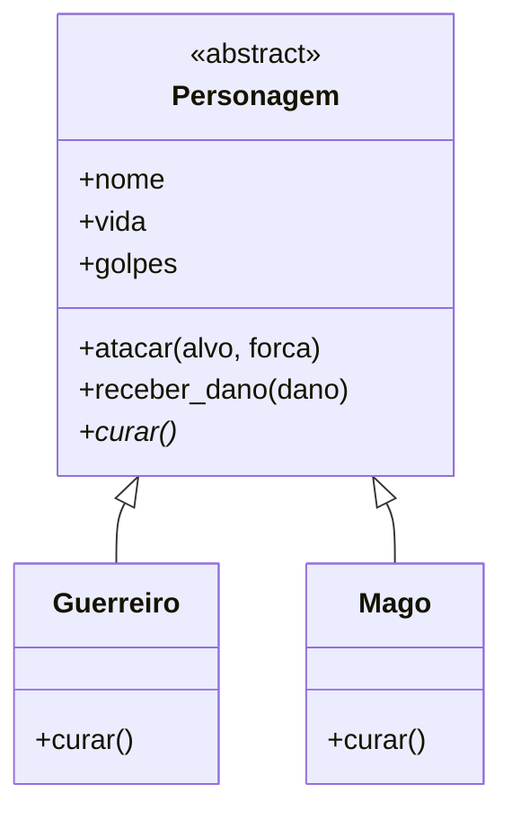

# Desafio 27

## Objetivo

Simule o sistema de batalha entre personagens de um RPG

```mermaid
classDiagram
    class Personagem {
        <<abstract>>
        +nome
        +vida
        +golpes
        +atacar(alvo, forca)
        +receber_dano(dano)
        +curar()*
    }
    class Guerreiro {
        +curar()
    }
    class Mago {
        +curar()
    }

    Personagem <|-- Guerreiro
    Personagem <|-- Mago
```